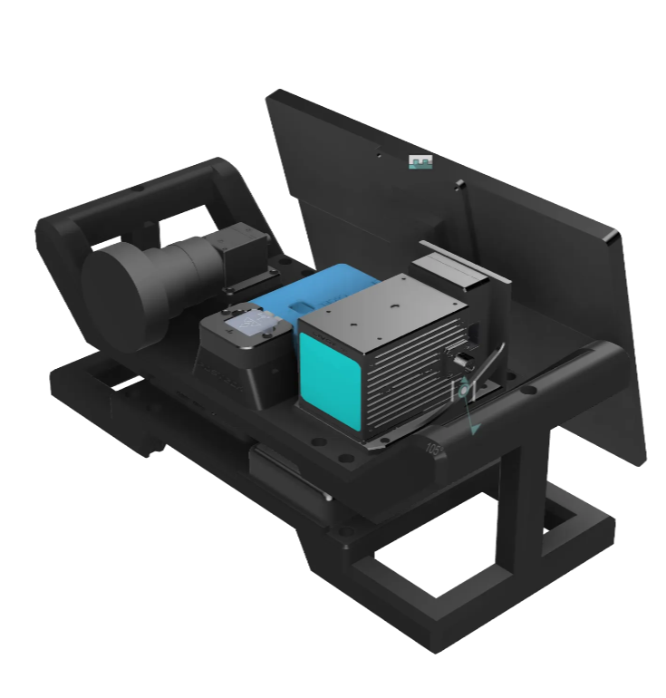
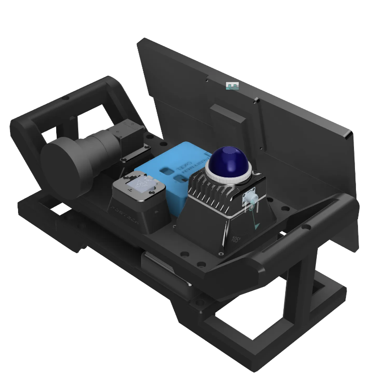

# CoCEL Handheld Dataset
Real-World dataset at POSTECH. 

## :arrow_down: Download
[Download Link](https://postechackr-my.sharepoint.com/:f:/g/personal/pash0302_postech_ac_kr/EowTrW_V_AdKvKDCpwzVKfIBcj1E7I1HYkN0OqzuoTGMEw?e=8PUNqo)  
You can find the description of the data in the [description section](https://github.com/SanghyunPark01/CoCEL_Handheld-Dataset?tab=readme-ov-file#page_facing_up-description).

## :page_facing_up: Description

### Data Acquisition
Datasets were acquired using the CoCEL handheld.  
- [CoCEL Handheld Driver(Link)](https://github.com/SanghyunPark01/CoCEL_Handheld_Driver)  
    - It is private now. It will open when a few remaining tasks are done.
- [CoCEL Handheld DataRecorder(Link)](https://github.com/SanghyunPark01/CoCEL_Handheld_DataRecorder)
- Hardware Design  
**Left** is AVIA version, **Right** is MID360 Version.  
Designed by [JunuHong](https://github.com/JunuHong)
<p align="center">
    
    
</p>

### Data Naming
File names are formatted like this: `acquisition_date`\_`location`\_`sequence`\_`sensor`\_`sync_info`.bag  
- `acquisition_date` : Data acquisition date.  
- `location` : Data acquisition location.  
- `sequence` : Indicates the sequence type.
- `sensor` : Livox AVIA or MID-360. Camera and IMU are same setting.  
- `sync_info` : Presence of sensor(LiDAR & Camera) synchronization.  

## :wrench: Calibration
Calibration data is available in the [download link](https://postechackr-my.sharepoint.com/:f:/g/personal/pash0302_postech_ac_kr/EowTrW_V_AdKvKDCpwzVKfIBcj1E7I1HYkN0OqzuoTGMEw?e=8PUNqo).  
### Camera Intrinsic
Camera intrinsic parameters were obtained using [ros_camera_calibration](https://wiki.ros.org/camera_calibration).  

### Camera-LiDAR Extrinsic
Camera and LiDAR extrinsic parameters were obtained using [livox_camera_calibration](https://github.com/hku-mars/livox_camera_calib).  


## :computer: Additional Software
- [Livox-Camera FOV Calculator](https://github.com/SanghyunPark01/livox_camera_fov_calculator) : Livox LiDAR & Camera FOV Overlap Calculator.  
- [End-to-End Error Evaluator](https://github.com/SanghyunPark01/CoCEL_Handheld-Dataset/blob/main/scripts/end_to_end_error.py) : End-to-End pose error evaluator in `/scripts/end_to_end_error.py`


## :email: Contact
- pash0302@postech.ac.kr
- pash0302@gmail.com

## :pencil: Citation  
If you use our datasets, please citation our dataset.  
```
@misc{park2025dataset,
  title={CoCEL Handheld Dataset},
  author={Park, Sanghyun},
  howpublished={\url{https://github.com/SanghyunPark01/CoCEL_Handheld-Dataset}},
  year={2025}
}
```
